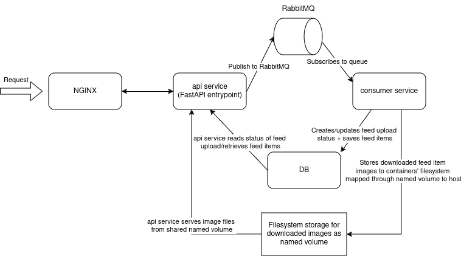

### Directory/Files breakdown

- **`clients/`**: contains db and rabbitmq client classes for easier connection management
- **`consumer/`**: holds the consumer service, service responsible for consuming from queue, parsing incoming xml and eventually saving new feed
- **`db_init/`**: contains initialization script (referenced in docker-compose.yml) for setting up the PostgreSQL database tables when starting up a container
- **`models/`**: contains data models represent database schemas or Pydantic models
- **`main.py`**: the FastAPI entry point, all the endpoints are accesible through this api
- **`logger.py`**: utility file used in multiple modules for simple logging purposes
- **`nginx.conf`**: configuration file for Nginx container (referenced in docker-compose.yml).

### How to Set Up the Project

#### Run whole project using `docker compose`

1. `cd` into the root of the project
2. To start the services build the images first with `docker compose build` and run them with `docker compose up`.
3. Access the (all of the provided are defaults in *docker-compose.yaml*): 
   - api service on port *4444*
   - adminer on port *8080*
   - rabbitmq management console on port *15672*
   - feed images will be stored in *{project_root}/app/images*

#### Run python services locally (e.g. for dev) and  the rest of the services using  `docker compose`

1. `cd` into the root of the project
2. **Set up a virtual environment (from root of the project)**:
   - If you're starting with a clean environment, run `python3 -m venv .venv` to create a new virtual environment.
   - Activate it with `source .venv/bin/activate` (Linux/MacOS) or `.venv\Scripts\activate` (Windows).
3. Run `pip install -r requirements.txt` to install all the required packages.
4. Run non-python services with `docker compose up db rabbitmq adminer` (no nginx)
5. Run FastAPI entrypoint in dev mode `fastapi dev main.py`
6. Run consumer service as module `python -m consumer.consumer`
7. Access the (all of the provided are defaults in *docker-compose.yaml* + defaults in python services if not overriden by env variables): 
   - api service on port *8000*
   - adminer on port *8080*
   - rabbitmq management console on port *15672*
   - feed images will be stored in *{project_root}/app/images*

### Architecture overview

#### Some of the decisions:

#### Api service request handling
- Information about existing records is retrieved directly from database
- Uploading a feed means, that api service will just create feed_upload record, which basically reports the state of the feed upload job. After that the api service publishes a message to rabbitmq with provided request.body() and returns a response with feed upload id (basically an ongoing job).
- Images are served from filesystem through shared named volume (between api and consumer service).

#### Publishing to RabbitMQ
- On startup of our api service, the service with help of rabbitmq_client creates the exchange and queue inside RabbitMQ dynamically at runtime 
- We are creating one exchange, because we will be using only one queue :'D and only one queue because, one kind of consumer is processing messages thus it is handled by one service and the processing logic is the same for every message.
- Message publishment from api service only checks for correct content-type, it does not validate provided data any way, it just publishes request.body() directly to RabbitMQ, all of the validation/checks are responsibility of consumer.
- For message publishment we are using DIRECT matching mode between exchange and queue as there are no other queues or specific rules.

#### Retrieving messages from RabbitMQ
- Consumer service acknowledges the message after whole processing has been done -> there is no special reasoning around this as only one service is subscribing to the queue and we are processing the message within *with statement* which I believe that acknowledges the message implicitly when the processing is finished.

#### General
- Clients inside the *clients* dir should provide simple abstraction above common functionality
- db_client.py is custom db client made with *asyncpg*, we use raw SQL, no entity tracking or anything similar to ORM. Initial thought was that it will be overkill to use ORM, but to be honest it would be probably easier and more readable in the end :/.
- db initialization is done using simple .sql script inside db_init dir and provided to docker-compose db service, no migrations or database schema tracking through code. Tbh I didn't even know that something like this is even possible -> to bind mount a .sql script to */docker-entrypoint-initdb.d/* and that it would be automatically applied.
- I feel like my usage of Pydantic models has been misused in a bad sense as I ended up using them as response models and some of them were re-used sort of for tracking a record retrieved and some served as kind of DTOs for provided feed items. There is no clear separation of their purpose.
- Logging was used only for my dev purposes and overall oversight of what's going on, nothing well thought-out.
- Simple pytests are part of consumer, as they are used during image build. They test some parsing/validation functionality of provided xml.

#### What can be enhanced
- way how we create upload job and after that publishes a message
- image sharing

#### Chosen tech stack
- From the chosen python libraries/frameworks, FastAPI was probably the only familiar to me (beside the built-in ones). All the others like aio_pika for rabbitmq communication or asyncpg for db client were chosen purely on popularity for my purpose. Basically the same goes for message queue or RDMS (SQL one was preferred as we are working with structured data).